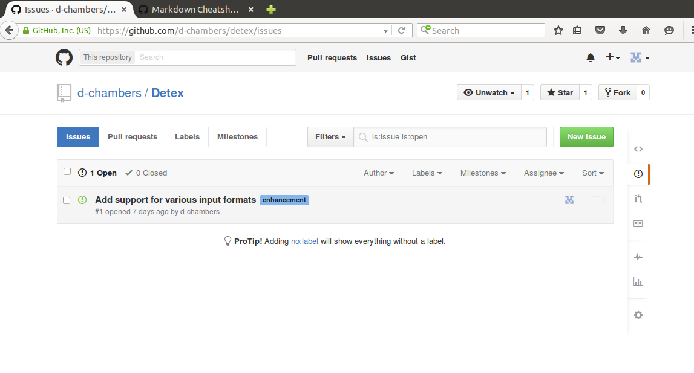
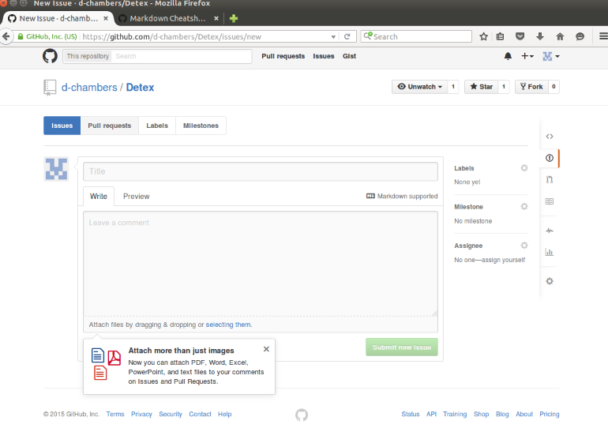

# Using and contributing to detex with github

[Detex](http://github.com/d-chambers/detex) is a python code for performing waveform similarity clustering and subspace detection. Anyone is welcome to contribute by following the steps listed below. As of version 0.2.0 [pep8](https://www.python.org/dev/peps/pep-0008/) is the governing style guide. 

## Get git
The first thing you need to do is download the version control software git. It is an incredibly useful tool that will enable you to contribute to group software. You also need to create a github account.  This is easy to do and can be done on [github's home page](https://github.com/).

### Linux
In Ubuntu and other Debian flavored Linux systems you can simply use apt-get to install git. In the command line type: 

```bash
sudo apt-get install git
```
or for most other flavors of Linux yum is the tool you need
```bash
sudo yum install git
```
After that you should be good to go. 

### Windows
In windows the easiest way to use git is to download [github for windows](https://desktop.github.com/). You can then run git commands form the git shell. 

### OS X
Who cares... google it or something.

### Learning git
I am only going to go over the bare minimum you will need here but I would strongly encourage you to go through a git tutorial. [This one](http://rogerdudler.github.io/git-guide/) is very good, as is [this one](https://www.atlassian.com/git/tutorials/).

## Setup and workspace and clone detex
I recommend that you set up a repository directory somewhere in home environment
```bash
cd ~
mkdir Gits
cd Gits
```
Now from within gits we can manage our all of our repositories. Let's start by cloning detex. 
```bash
git clone http://github.com/d-chambers/detex
```
Now you will notice a new directory has appeared. Inside we can see a new directory called detex. We can install detex on our local machine by running the setup.py file. 
```bash
cd detex
python setup.py install
```

## Reporting bugs and requesting features
After using detex it is likely that you will find a bug. When this happens the first thing to do is log into your github account and navigate to the (detex page)[http://github.com/d-chambers/detex]. In the upper right corner you will see a tab  that says issues. It looks like this (I have highlighted it):


Issues is the menu where all bugs are reported, enhancements are requested, and you can submit your own features or fixes to be merged into detex with something called a "pull" request. More on that in a minute. The menu looks like this: 





If you click on the new issue you get this menu: 



Here you can fill out what issue you are having and assign a category by clicking on the cog next to the word label. The important ones for you to know are:

* bug : The code needs fixing
* enhancement : You would like to see a feature added
* question : You need to know something

You can also attach files or screen shots to issues, in fact, **It is very import you attach all files needed to reproduce a bug when filling out an issue.**


## Fixing a bug or adding a feature
Now suppose after filling out an issue request you have come up with a brilliant fix. Log into your github account and get ready to contribute. 

Next fork detex to your account (this is like making a copy you can access). To do this click on the fork button right above the issues tab in detex's main page. Now clone detex again (in fact you can delete the old one) but this time from your account. So for example, if your github account name is RL-Stein you would type:

```bash 
git clone http://github.com/RL-Stein/detex
```

Now make the fix to the python script that you came up with and drop it into the new detex repo. This will probably mean that you find the detex packge you have made changes on (perhaps in Anaconda/lib/python2.7/site-packages/detex) and copy it to Gits/detex/detex. Now while in the detex repo (directory) follow the following git commands to load it to your github account:

```bash
git add -A # Adds the changes to your staging area
git commit -m "Fix to issue x" # A message to explain what this commit is about
git push origin master # push the master branch to the remote (eg http://github.com/RL-Stein/detex)
```

Next go back to the detex page and click on the pull request tab and fill it out. This will let you veiw the changes made to the code and notify the admins that you want to merge your work into the master branch. It will be reviewed, and if approved, merged into the master branch so everyone can benefit from your hard work. 

Good job!

Now make sure you click the watch button on the main detex page so you will be notified when new releases come out. in the future make sure to update your fork of detex so you get the latest changes. [Here](http://stackoverflow.com/questions/7244321/how-to-update-a-github-forked-repository) is a good guide for doing so, but it will require a bit more git knowledge so be sure to go through one of the tutorials. 

